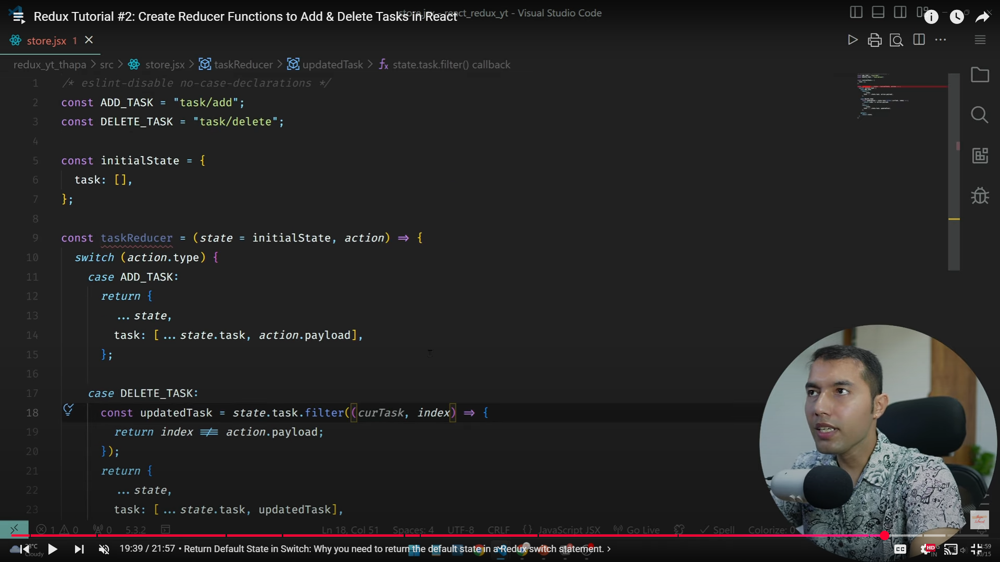
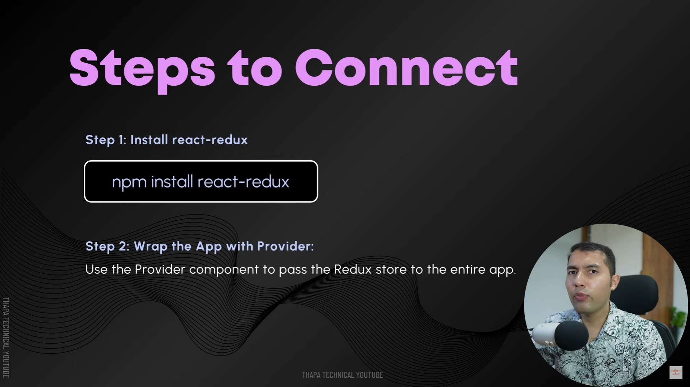
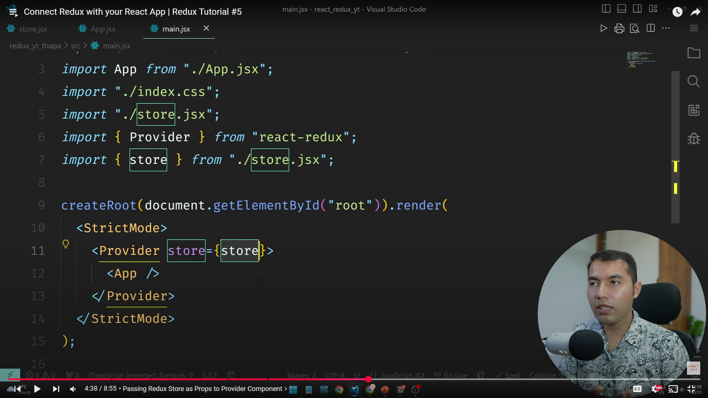
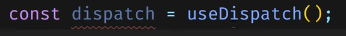
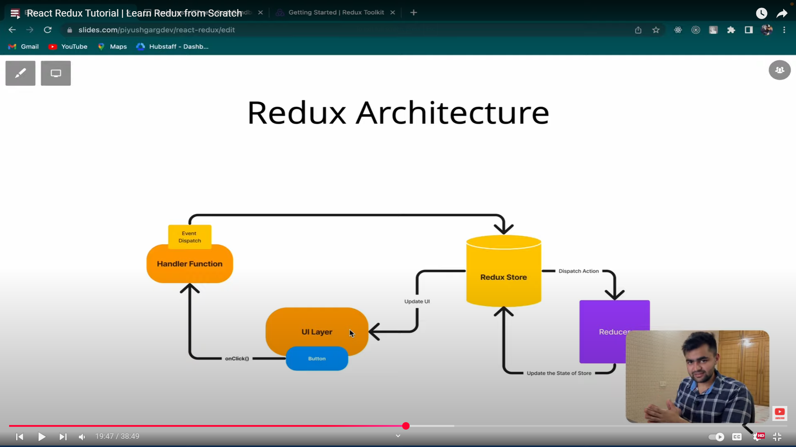
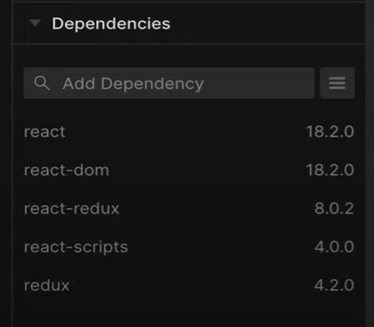

# prac 00



# prac 01





 # prac02
----




# prac03 : Add redux devTools in chrome
1. Add redux devTools extension 

2. Add following package
```
npm i @redux-devtools/extension
```

3. Add in store.jsx
```javascript
import { composeWithDevTools } from '@redux-devtools/extension';
```

4. Create store like this
```javascript
let store = createStore(taskReducer, composeWithDevTools());
```

5. Now in your website, open `inspact`  >> select `Redux`

<br/>
<br/>
<br/>

## Redux Thunk
Used when , we want to do an API request in `Redux`.


**Steps 1  :**

```v 
npm install redux-thunk
```

**Steps 2 :**

```javascript
// store.jsx
import { createStore, applyMiddleware } from 'redux'  
import thunk from 'redux-thunk'
```

**step 3 :**
```javascript
// update below line in store.jsx
let store = createStore( 
    taskReducer, 
    composeWithDevTools( applyMiddleware(thunk) )
    );
```

**step 4 :**
### In store.jsx file

<!--  -->

### In App.jsx file


`handleFetchTasks` runs on `fetch` button's `onClick` event ex., `onClick={handleFetchTasks}`
<hr>
<br>
<br>

> ### Piyu Garg 



 npm package need to install